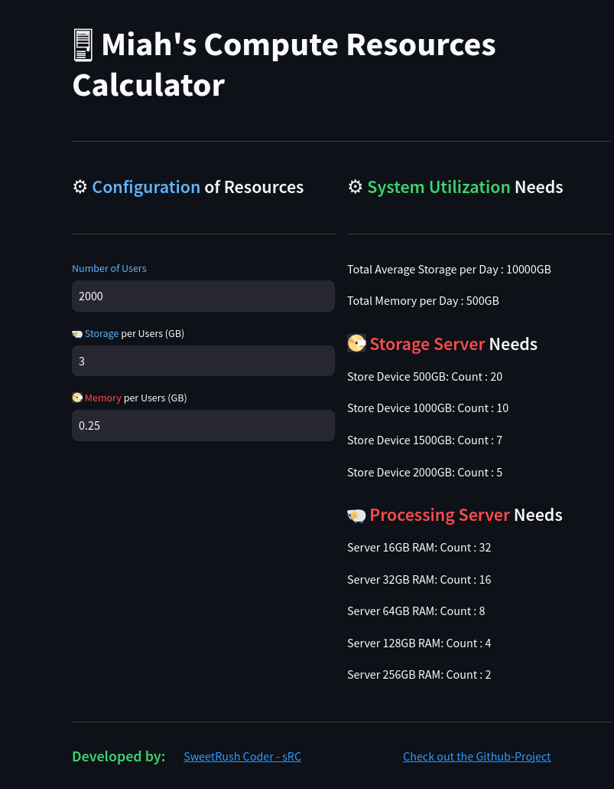

# ComputerResourceCalc
 This is an Application that tries to calculate the resourcs requried to run in terms of elements such as storage and ram




 ### How to Run it locally
 Download the application or the python file and then using streamlit run the application. 

- To download streamlit do the following command 
```bash
pip install streamlit 
```

- To run the appliaction it would be the following command. 
```bash
streamlit run appresourcecalc.py
```

This will open up the streamlit appliaction in your default browser. 

### Try it now 
You can also try the app your online now at the following URL:
[Online ComputerResourceCalc Run it now](https://sweetrush-computerresourcecalc-appresourcecalc-rezmuj.streamlit.app/)

